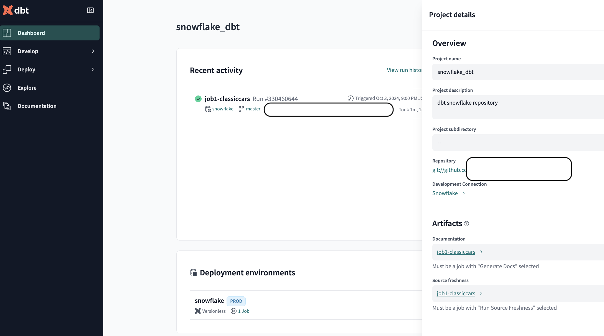
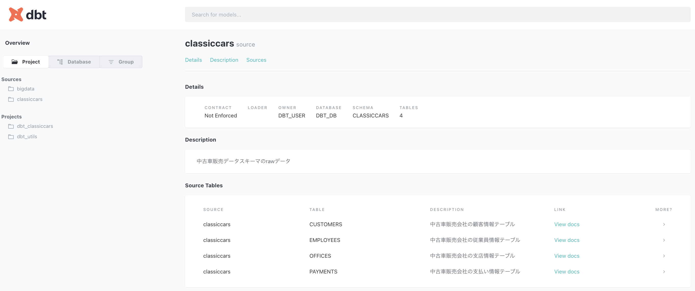

# プロジェクト概要
本プロジェクトはdbtの諸機能を検証するために作成した実機検証プロジェクトである  
今回はSnowflakeでの検証を行った

## 構成
dbtの特徴的な機能に関して下記構成に沿って検証した
1. dwhとの接続および権限設定
2. プロジェクトの構成
3. モデリング
4. テスト
5. ドキュメント
6. ソース機能
7. シード機能
8. スナップショット機能
9. dbt Packages
10. 【おまけ】dbt cloudとdbt coreの違い
11. 今回の検証で参考にしたドキュメント

## 1.dwhとの接続および権限設定


## 2.プロジェクトの構成
dbtから参照するDWH(Snowflake)のDB,SCHEMA,TABLE構成
```
DBT_DB
├── BIGDATA
│     ├── APR_2020
│     └── MAR_2020
└── CLASSICCARS
      ├── CUSTOMERS
      ├── EMPLOYEES
      ├── MAPS_BRAND(seedによりdbtから生成)
      ├── OFFICES
      └── PAYMENTS
```

dbtのプロジェクトは下記構成で開発を行う(初回build時に自動生成される)
```
dbt_training
├── analysis
├── dbt_project.yml
├── docker-compose.yml
├── macros
├── models
├── seeds
├── snapshots
├── target
└── tests
```


## 3.モデリング
### 新規schemaの自動作成
```sql:classiccars_offices.sql
   with source as (
      -- 新規schemaをソーステーブルが存在するDBへ新規作成したい場合は
      -- '{{ config(schema='marketing') }}'を記載する
      -- schema='xxx'で元schema名 + _xxxという新規schemaが作成される
      select * from {{ source('classiccars', 'OFFICES') }}
   ),
```

## 4.テスト
テストによって品質の低いデータの混入を検知してアラートしたり、データの品質を保ったりするのに使います。

### テストの種類
1. Singularテスト
   SELECT文のみ使用可能。存在してはいけないレコードをSELECT句で記述する。レコードの取得の成否を調べるクエリを用いる。  
   4月データの金額でマイナス価格の商品がないか確認する
   ```sql:sig_sample_test.sql
   select * from {{ source('bigdata', 'APR_2020') }}
   WHERE price < 0
   ```

2. Genericテスト(標準)
   dbt には始めから用意されている規定の Generic テストがあり、それを利用したテストを設定できます。
   * unique
      指定されたカラムのデータがすべてユニーク値であること
   * not_null
      指定されたカラムが null を含まないこと
   * accepted_values
      指定されたカラムには、指定された値以外を含まないこと
   * relationships
      指定されたカラムの値が、`to`に指定されたモデルの`field`に指定されたカラムに含まれていること  

   ymlファイルへの記載で設定が可能
   ```yml:classiccars_sources.yml
   version: 2
   sources:
   - name: classiccars
      description: 中古車販売データスキーマのrawデータ
      database: DBT_DB
      schema: CLASSICCARS
      tables:
         # 支店テーブルへの前処理を設定する
         - name: OFFICES
         description: 中古車販売会社の支店情報テーブル        
         columns:
            - name: OFFICECODE
               description: 支店番号
               # データテストを設定可能
               tests: 
               - unique
               - not_null
   ```
   
3. Genericテスト(カスタム)
   標準のGenericテストでは不足する場合、自作のGenericテストを作成可能  
   ファイルの配置 : `test-path`の直下の`generic`ディレクトリ  
   sqlファイルへの記載で設定が可能
   ```sql:classiccars_sources.yml
   
      select *
      from {{ model }}
      where {{ column_name }} is null
   
   ```

   カスタムテストクエリを作成したら、テスト対象となるテーブル定義しているymlファイルで呼び出す
   ```yml:classiccars_sources.yml
   version: 2
   sources:
   - name: classiccars
      description: 中古車販売データスキーマのrawデータ
      database: DBT_DB
      schema: CLASSICCARS
      tables:
         # 支店テーブルへの前処理を設定する
         - name: OFFICES
         description: 中古車販売会社の支店情報テーブル        
         columns:
            - name: OFFICECODE
               description: 支店番号
               # データテストを設定可能
               tests: 
               - unique
               - my_not_null←これ

         - name: CUSTOMERS
         description: 中古車販売会社の顧客情報テーブル
         columns:
            - name: CUSTOMERNUMBER
               description: 顧客番号
               tests:
               - unique
               - my_not_null←これ
   ```


## 5.ドキュメント
dbtのドキュメント機能を活用するため、以下のコマンドを実行し、ドキュメント用のファイルを生成する。
ドキュメント生成`dbt docs generate`  
ドキュメント表示用サーバ起動`dbt docs serve`  
**※dbt Cloud CLIまたはdbt Coredbt docs serveを使用してローカルで開発している場合は、 コマンドを使用します。dbt Cloud IDE はこのコマンドをサポートしていません。**  

cloud IDEを使用する場合は？
1. 「Dashbord」の「Setting」を開き、「Artifacts」のDocumentationからDeploy済みのJobを選択する
   
2. 「Documentation」を選択する
ブラウザで別タブが開きドキュメントが表示される
   

#### 静的ページとしての公開も可能
target配下にある３つのファイルを好きなサーバで公開することが可能  
↓対象ファイルと生成場所
```
target
├── index.html
├── manifest.json
└── catalog.json
```

## 10.
**coreとcloudの大きな差分は「ジョブスケジューラの有無」**  
core : オーケストレーションツールが必要  
cloud : deploy機能でスケジューリング可能  

**その他の差分**  
1. クラウド統合開発環境(IDE)
2. 

## 12.その他
1. 3ヶ月1度バージョンアップが走る
2. 


## 11.今回の検証で参考にしたドキュメント
1. [dbt入門](https://zenn.dev/foursue/books/31456a86de5bb4/viewer/04bca4)  
   Zenn : 菱沼 雄太さん

2. [Snowflake & dbt Cloudハンズオン実践](https://dev.classmethod.jp/articles/snowflake-dbt-cloud-handson-challenge-vol2/)  
   classmethod

3. [dbtベストプラクティスを読む](https://zenn.dev/kyami/articles/4438f4d64185b4)  
   Zenn 著者 : kyamiさん

4. [dbt公式docs](https://docs.getdbt.com/)  
   dbt公式ドキュメント

5. [dbt Cloudにおけるプランの違いについて](https://dev.classmethod.jp/articles/differences-between-plans-in-dbt-cloud/)  
   classmethod

6. [dbt公式サイト](https://www.getdbt.com/pricing)  
   dbt公式サイト

7. [dbt Core & dbt Cloud: What’s the Difference?](https://cookjack248.medium.com/dbt-core-dbt-cloud-whats-the-difference-12993acc890a)  
   著者 : ??

8. [dbt Coreとdbt Cloudの関係性・違いなどについてまとめてみた](https://dev.classmethod.jp/articles/differences-between-dbt-core-and-dbt-cloud/)  
   clasmethod